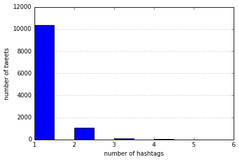
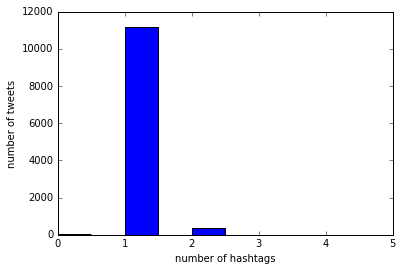
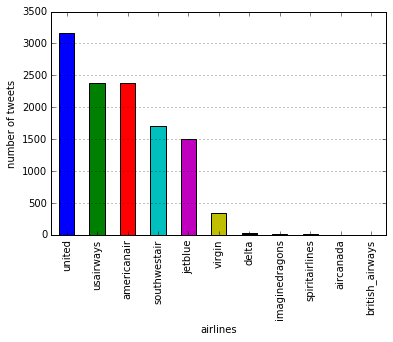
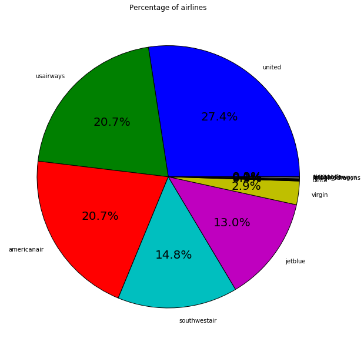
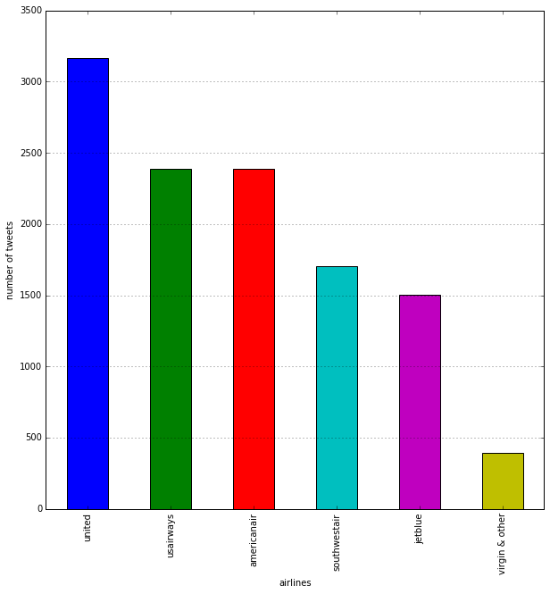
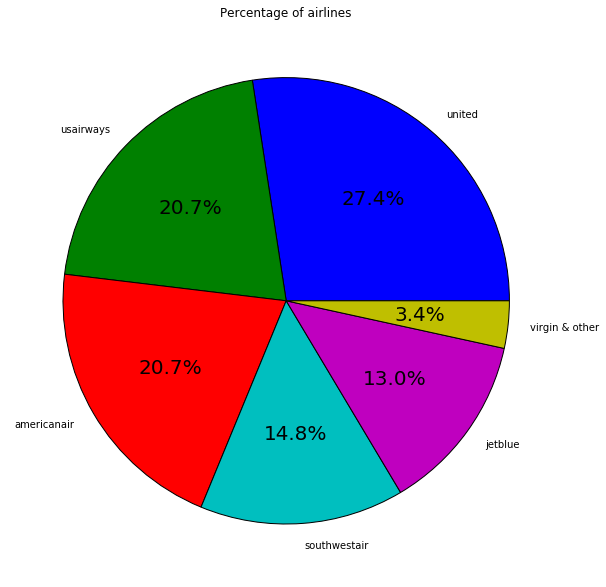
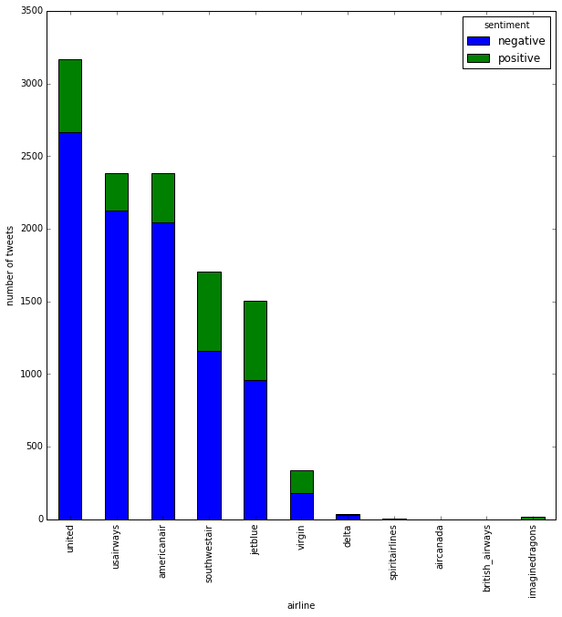
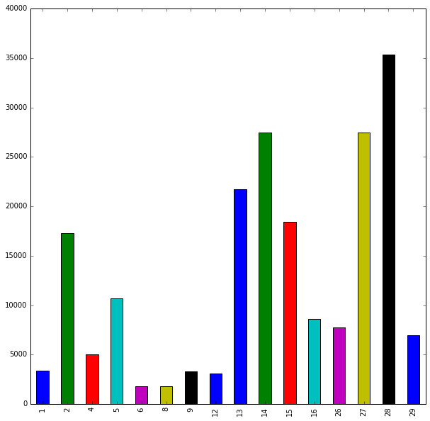
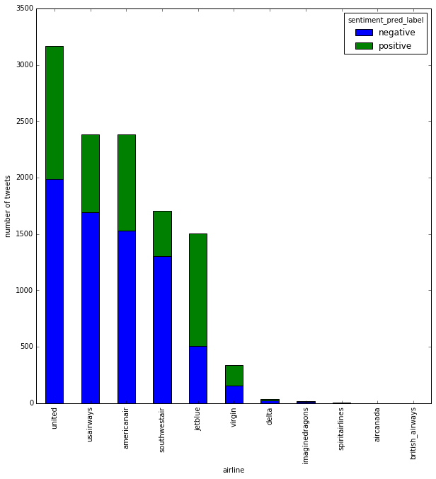
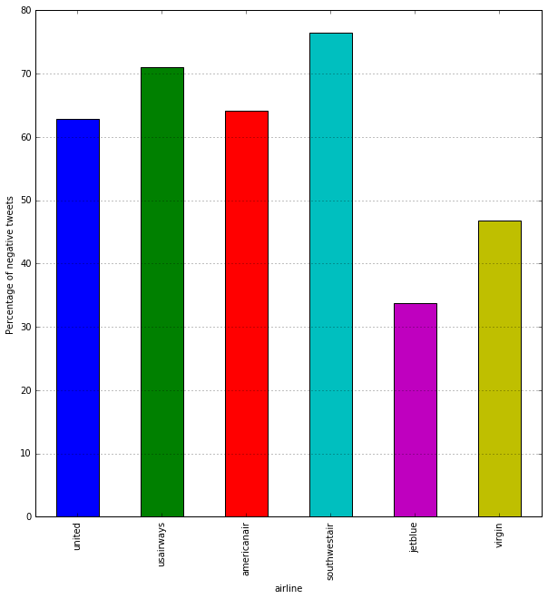

```python
# /resources/sun_1003982559_assignment1.ipynb
```

## 1. Data Cleaning
> The tweets, as given, are not in a form amenable to analysis -- there is too much ‘noise’. Therefore, the first step is to “clean” the data. Design a procedure that prepares the Twitter data for analysis by satisfying the requirements below.
- All html tags and attributes (i.e., /<[^>]+>/) are removed.
- Html character codes (i.e., &...;) are replaced with an ASCII equivalent.
- All URLs are removed.
- All characters in the text are in lowercase.
- All stopwords are removed. Be clear in what you consider as a stopword.
- If a tweet is empty after pre-processing, it should be preserved as such.

First I define some functions to do the cleaning:


```python
import re
import html


# remove all HTML tags and attributes
def remove_HTML_tags(text):
    tags_re = re.compile('<[^>]+>')
    return tags_re.sub('', text)

# decode HTML entities
def decode_HTML(text):
    return html.unescape(text)

# remove URLs
def remove_URLs(text):
    return re.sub(r'https?:\/\/.*[\r\n]*', '', text, flags=re.MULTILINE)

# transform all letters to lowercase
def transform_to_lower(text):
    return text.lower()

# get stopwords from txt
with open('stop_words.txt') as f:
    lines = f.readlines()
    stopwords_from_txt = [line.strip() for line in lines]
    
# remove stopwords 
def remove_stopwords(text, stopwords=stopwords_from_txt):
    word_list = text.strip().split(' ')
    word_list_without_stopwords = [word for word in word_list if word not in stopwords]
    return ' '.join(word_list_without_stopwords)

# clean text with all the functions above
def clean_text(text):
    return remove_stopwords(transform_to_lower(remove_URLs(decode_HTML(remove_HTML_tags(text)))))
```

Import data from CSV files and apply the cleaning function:


```python
import pandas as pd
import time

FILENAME_GENERIC = 'generic_tweets.csv'
FILENAME_AIRLINES = 'US_airline_tweets.csv'

generic_df = pd.read_csv(FILENAME_GENERIC)
print(FILENAME_GENERIC, "successfully read.", generic_df.shape[0], 'lines in total.')
airlines_df = pd.read_csv(FILENAME_AIRLINES)
print(FILENAME_AIRLINES, "successfully read.", airlines_df.shape[0], 'lines in total.')

start_time = time.time()
generic_df['text_cleaned'] = generic_df['text'].apply(clean_text)
generic_finish_time = time.time()
print('Generic text cleaned! It took', generic_finish_time - start_time, 'seconds')
airlines_df['text_cleaned'] = airlines_df['text'].apply(clean_text)
print('Airlines text cleaned! It took', time.time() - generic_finish_time, 'seconds')


```

    generic_tweets.csv successfully read. 200000 lines in total.
    US_airline_tweets.csv successfully read. 11541 lines in total.
    Generic text cleaned! It took 34.406073570251465 seconds
    Airlines text cleaned! It took 2.8220925331115723 seconds


Compare texts before and after cleaning:


```python
pd.set_option('max_colwidth',100)
print('Before cleaning:')
print(airlines_df['text'].head())
print('\n')
print('After cleaning:')
print(airlines_df['text_cleaned'].head())
```

    Before cleaning:
    0                               @VirginAmerica plus you've added commercials to the experience... tacky.
    1    @VirginAmerica it's really aggressive to blast obnoxious "entertainment" in your guests' faces &...
    2                                                @VirginAmerica and it's a really big bad thing about it
    3    @VirginAmerica seriously would pay $30 a flight for seats that didn't have this playing.\nit's r...
    4                  @VirginAmerica yes, nearly every time I fly VX this “ear worm” won’t go away :)
    Name: text, dtype: object
    
    
    After cleaning:
    0                                            @virginamerica commercials experience... tacky.
    1    @virginamerica it's aggressive blast obnoxious "entertainment" guests' faces & recourse
    2                                                          @virginamerica it's big bad thing
    3           @virginamerica seriously pay $30 flight seats playing.\nit's bad thing flying va
    4                                  @virginamerica yes, time fly vx “ear worm” won’t :)
    Name: text_cleaned, dtype: object


## 2. Exploratory analysis
> - Design a simple procedure that determines the airlineof a given tweet and apply this procedure to all the tweets in the US airlinedataset. A suggestion would be to look at relevant  words  and  hashtags  in  the  tweets  that  identify  to  certain airlines.  What  can you say about the distribution of the US airlinesof the tweets?

First I try to figure out the number of hashtags in each tweet.


```python
def count_hashtag(text):
    return text.count('@')

airlines_df['hashtag_numbers'] = airlines_df['text_cleaned'].apply(count_hashtag)
airlines_df.hashtag_numbers.value_counts()
```


    1    10326
    2     1076
    3      106
    4       24
    5        7
    6        2
    Name: hashtag_numbers, dtype: int64


For better understanding, a bar chart is plotted.


```python
%matplotlib inline
import matplotlib.pyplot as plt

plt.close('all')
plt.hist(airlines_df.hashtag_numbers)
plt.xlabel('number of hashtags')
plt.ylabel('number of tweets')
plt.grid(axis='y', alpha=0.75)
plt.show()
```





It can been seen that quite a lot of tweets have multiple hashtags, thus I need to find all the hashtags in each tweet:


```python
def find_hashtags(text):
    return re.findall(r"@(\w+)", text)

airlines_df['hashtags'] = airlines_df.text_cleaned.apply(find_hashtags)
```

Let's look at those multiple hashtags in one tweet:


```python
airlines_df.hashtags[airlines_df.hashtags.apply(len)>2]
```


    34                    [virginamerica, ladygaga, carrieunderwood, ladygaga, carrieunderwood]
    37                                               [virginamerica, ladygaga, carrieunderwood]
    39                                               [virginamerica, ladygaga, carrieunderwood]
    48                                                   [virginamerica, southwestair, jetblue]
    348                                                           [united, highbuddyyy, united]
    436                                                           [united, americanair, united]
    560                                                             [united, fly2ohare, flypdx]
    657                                                        [united, reebok, rockinwellness]
    667                                                        [united, flysaa, united, flysaa]
    764                                                             [united, united, keambleam]
    820                                                        [united, americanair, usairways]
    894                        [united, seanmfmadden, peterstraubmma, jmercadomma, tonysimsmma]
    998                                                         [united, united, bdl, preboard]
    1012                                                     [united, ciscojimfrench, cobedien]
    1287                                                          [united, united, erieairport]
    1441                                                     [united, tiffanyandco, ntrustopen]
    1539                                                                [united, delta, united]
    1746                                                          [united, foxnews, cnn, msnbc]
    1817                                          [united, usairways, americanair, americanone]
    1944                                                             [united, comcast, xfinity]
    1966                                                      [united, continentalair1, united]
    2170                                                        [united, flysfo, sydneyairport]
    2217                                    [united, americanair, southwestair, delta, jetblue]
    2469                                                        [united, gg8929, unitedappeals]
    2676                                                                   [united, ups, fedex]
    2816                                                  [united, hotelstonight, startingbloc]
    2985                                                              [united, virgin, jetblue]
    3018                                             [united, ftlauderdalesun, orlandosentinel]
    3132                                                          [united, pgatour, ntrustopen]
    3133                                                          [united, pgatour, ntrustopen]
                                                    ...                                        
    9302                                                      [americanair, delta, americanair]
    9303                                                          [americanair, jetblue, delta]
    9427                                                      [americanair, delta, americanair]
    9428                                                          [americanair, jetblue, delta]
    9551                                                      [americanair, mauererpower, gogo]
    9611                                                [americanair, usairways, flylaxairport]
    9683                                                      [americanair, iata, thefaaonline]
    9785     [americanair, united, spiritairpr, fioretti2ndward, chicagosmayor, garcia4chicago]
    9808                                              [americanair, megentripodi, jordnnicole7]
    9816                                                [americanair, chicagotribune, wsj, cnn]
    9830                                         [americanair, suntimes, wsj, latimes, nytimes]
    9846                                            [americanair, wsj, latimes, chicagotribune]
    9851                                           [americanair, louprice13, aacustomerservice]
    9900                                           [americanair, momsgoodeats, mandarinjourney]
    9919                                                    [americanair, usairways, bbb_media]
    9962                                                            [americanair, delta, delta]
    10077                                                 [americanair, kanne822, southwestair]
    10291                                     [americanair, cnn, nbsnewsr, cnnbrk, americanair]
    10417                                         [americanair, cathaypacific, cathaypacificus]
    10451                                                      [americanair, andyellwood, delk]
    10475                                                   [americanair, amexserve, usairways]
    10579                                                    [americanair, usairways, usairwis]
    10661                                                  [americanair, emeyerson, ggreenwald]
    10785                                                 [americanair, arminrosen, ggreenwald]
    10845                                           [americanair, spiritairlines, greyhoundbus]
    11031                                                 [americanair, americanair, usairways]
    11123                                                   [americanair, jetblue, americanair]
    11189                                         [americanair, delta, jetblue, spiritairlines]
    11195                                         [americanair, delta, jetblue, spiritairlines]
    11273                                          [americanair, sentierimelinda, southwestair]
    Name: hashtags, Length: 135, dtype: object


It turns out that there are many hashtags irrelevant with airlines (eg. ladygaga). To find out the most frequent hashtags, concatenate the hashtag lists of all tweets and count the value:


```python
import numpy as np


hashtags_series = pd.Series(np.concatenate(airlines_df.hashtags))
hashtags_series.value_counts()
```


    united             3191
    usairways          2607
    americanair        2462
    southwestair       1788
    jetblue            1519
    virginamerica       344
    delta                60
    imaginedragons       17
    phlairport           17
    dfwairport           12
    fortunemagazine      10
    spiritairlines        8
    love_dragonss         7
    cowboycerrone         6
    gg8929                6
    dulles_airport        6
    wsj                   6
    cnn                   6
    staralliance          6
    aircanada             6
    expedia               5
    virginatlantic        5
    southwest             4
    carrieunderwood       4
    silverairways         4
    tsa                   4
    ladygaga              4
    ny_njairports         4
    velourlive            4
    kylejudah             4
                       ... 
    challemann            1
    heidimacey            1
    of                    1
    bdindallas            1
    paytontaylor129       1
    ezemanalyst           1
    dawn_davis            1
    jhamilton2007         1
    barrettkarabis        1
    kentuckymbb           1
    me                    1
    chicagomidway         1
    luxclark              1
    ernie_vigil           1
    wtop                  1
    freddieawards         1
    jeff_hofmann          1
    nickcunningham1       1
    megzezzo              1
    peterstraubmma        1
    tonysimsmma           1
    yorkshire2002         1
    emilylyonss           1
    gripeo                1
    sfo                   1
    stacycrossb6          1
    cathaypacific         1
    rockinwellness        1
    edplotts              1
    sweetmel              1
    Length: 660, dtype: int64


I look into the list above and work out a list of airlines manually, as in the `airlines` list in the function below. To remove duplicated and irrelevant hashtags:


```python
def filter_hashtags(hashtag_list):
    airlines = ['united', 
                'usairways', 
                'americanair',
                'southwestair',
                'jetblue',
                'virginamerica',
                'delta',
                'imaginedragons',
                'spiritairlines',
                'aircanada',
                'virginatlantic',
                'southwest',
                'silverairways',
                'british_airways',
                'americanairlines'
               ]
    hashtags_filtered = [hashtag for hashtag in list(set(hashtag_list)) if hashtag in airlines]
    return hashtags_filtered

airlines_df['hashtags_filtered'] = airlines_df['hashtags'].apply(filter_hashtags)
```

Look at the number of hashtags again:


```python
print(airlines_df.hashtags_filtered.apply(len).value_counts())

plt.close('all')
plt.hist(airlines_df.hashtags_filtered.apply(len))
plt.xlabel('number of hashtags')
plt.ylabel('number of tweets')
plt.show()
plt.close()
```

    1    11148
    2      370
    3       16
    0        4
    4        2
    5        1
    Name: hashtags_filtered, dtype: int64





There are still hundreds of tweets that have more than one hashtag. Take a look at the original text:


```python
airlines_df.text[airlines_df.hashtags_filtered.apply(len)>1]
```


    48       @VirginAmerica why can't you supp the biz traveler like @SouthwestAir  and have customer service...
    114      @VirginAmerica congrats, you just got all my business from EWR to SFO/LAX. Fuck you @united fl12...
    152      @VirginAmerica had to change to another airline to get to DC today ... Why is @united able to la...
    199      @VirginAmerica @VirginAtlantic I have just checked in flight to SFO from LAX &amp; been told as ...
    238      @VirginAmerica I spoke with a representative that offered no solution, I am a loyal customer who...
    243      @VirginAmerica of course! I work for @VirginAtlantic and I'm obsessed with the entire Virgin fam...
    292      @VirginAmerica love it, taking @SouthwestAir on in their backyard! Consumers win when biz competes.
    352                                                   @united thats weak. See ya 👋\nHey @VirginAmerica !!
    357      @united why no preferred security line anymore. My TSA pre-check didn't pull on my @SilverAirway...
    436               .@united it will be because I'm moving to @AmericanAir because of @united talk, no service
    587                       @united @AmericanAir spent hundreds to rectify the situation and you guys go quiet
    589      @united @AmericanAir so that's it? It just ends there? Come on! I traveled for literally an extr...
    654      @united the proper response: sorry for your wait, what flight # were you on so we can look into ...
    673      @united your helpful agents in Club helped.  I am just out baggage fees and a night of my life.s...
    675      @SouthwestAir doesn't charge ticket change fees. Do they not incur the same mysterious "costs" t...
    683      @united should NOT sell tickets for @SilverAirways on http://t.co/onhXHCO6bK.  has terrible serv...
    706      @united first time flying with United. Also last time. #terrible back to @VirginAtlantic for me....
    707      @united I used to be a committed #ContinentalAirlines flyer until merger. I remember now why I s...
    820      @united wow you even answered back!  Awesome! @AmericanAir @USAirways That's customer service!!!...
    836         @united what a pointless tweet. At least @AmericanAir asked me to follow them to try and resolve
    864      @united Cancelled Flights flt from EWR. "No crew".Tells wife &amp; 4 yr old to "get to NY to cat...
    887      @united looks like today will be my 6th consecutive delayed flight from you...do I win a prize??...
    901      @united I paid for economy plus and you put me in the last boarding group so I have to gate chec...
    918      @united is the worst. Worst reservation policies. Worst costumer service. Worst worst worst. Con...
    930      @united 2nd flight in two weeks that you have lost my bag!  Taking my 1K status to @AmericanAir ...
    1105     @united considering it. Currently gold on @delta. Why should I make the jump for an upcoming fli...
    1146     @united time to give up my 1K status and switch to @Delta - you are so terrible I can't even des...
    1190                                        @united good try but @SouthwestAir got her here safer and sooner
    1383                                       @united this is why I fly @SouthwestAir ... Never have any issues
    1514     @united your first class is a joke, compared to all the others I have flown, don't ask for extra...
                                                            ...                                                 
    10439    @AmericanAir @USAirways outbound flight: 2 hour delay b/c air traffic &amp; 2 gate changes divid...
    10472                                        @AmericanAir worst experience ever. @VirginAmerica all the way!
    10475    @AmericanAir thanks to Jacqueline in CLT for cleaning up @amexserve and @USAirways mess!!! Aweso...
    10489    @AmericanAir tisk tisk. Rude flight attendants yet again. I can't hang my suit up because I didn...
    10542              last trip on @AmericanAir ... Poor customer service 3 trips in a row! @Delta here I come!
    10579    @AmericanAir this merger with @USAirways @usairwis a cluster of inefficiency and misinformation....
    10641               @AmericanAir @USAirways wonderful FC FA on flight 2062 pre dawn!  Nice start to the day!
    10655    @AmericanAir @British_Airways 2 weeks ago today i arrived in miami and I still don't have my bag...
    10687    @AmericanAir highly disappointed in the baggage service with this merge with @USAirways you guys...
    10697    .@AmericanAir @USAirways Add insult to injury you guys "misplaced" my bag. \n\nCan't believe you...
    10799    @AmericanAir @USAirways and our meals are also on us, because this company does not care about t...
    10801    @AmericanAir @USAirways cost me a day of vacation ($350 hotel stay), day of dog boarding, and a ...
    10804    @AmericanAir @USAirways and the way I have been spoken to by #DFW and #Mia employees is truly di...
    10817    @AmericanAir but at least your automated message gives me info about your merger w/ @USAirways. ...
    10845    @AmericanAir is the new @SpiritAirlines, and both are worse than taking the @GreyhoundBus #ameri...
    10887    @AmericanAir @USAirways how can you have no food on a 4 hour flight 528 from Columbus to Phoenix...
    10967    @AmericanAir gotta be worse than @delta w/ on time departures.  I rushed back to terminal C for ...
    11014    @AmericanAir I spent $600 on my flight. Could have gone on @united for $382 but their mileage pr...
    11029    @AmericanAir whenever I cheat on you it goes horribly wrong! I promise, I won't stray anymore. I...
    11031    @AmericanAir I need help with a reservation purchased on @AmericanAir but operated on @USAirways...
    11109    @AmericanAir really? Not even worthy of a response. This is beginning of a social media alert to...
    11123    @AmericanAir versus @JetBlue \nin Customer Service?\nWho will win!\nFor Me @AmericanAir is a con...
    11126         @AmericanAir ah if only we could get through. We've tried for over 2 hrs. Can we call @united?
    11189    @AmericanAir @Delta @JetBlue can you help? @SpiritAirlines is in the wrong, stuck in Florida 3da...
    11195    @AmericanAir @Delta @JetBlue I am going to be stuck in Florida for 3 days because @SpiritAirline...
    11229    @AmericanAir the fact that that rule makes it poor customer service. I can Cancelled Flight/chan...
    11236    As am I, @AmericanAir - but thankfully there was a @united lounge next door. Really not impresse...
    11273    @AmericanAir @SentieriMelinda Any updates? It shouldn't take hours for assistance. I love @South...
    11288    @AmericanAir you have such a confusing web site/complicated ordering process. This is why I typi...
    11431    @AmericanAir bought a ticket on @SouthwestAir. After two days, your "team" couldn't share the da...
    Name: text, Length: 389, dtype: object


Most of the tweets has exactly one hashtag now, which can be used in determining which airline the tweet is about. For those with multiple hashtags after filtering, simply take the first one into consideration. Note that some different tashtags may refer to the same airline, use a dict to combine them:


```python
def determine_airline(hashtag_list):
    if not hashtag_list:
        return None
    else:
        hashtag = hashtag_list[0]
        replacement_dict = {'americanairlines':'americanair',
                            'virginatlantic':'virgin',
                            'virginamerica':'virgin',
                            'southwest':'southwestair'}
        return replacement_dict[hashtag] if hashtag in replacement_dict else hashtag

airlines_df['airline'] = airlines_df.hashtags_filtered.apply(determine_airline)
airlines_df.airline.value_counts()
```


    united             3164
    usairways          2385
    americanair        2385
    southwestair       1707
    jetblue            1501
    virgin              335
    delta                35
    imaginedragons       17
    spiritairlines        6
    aircanada             1
    british_airways       1
    Name: airline, dtype: int64


Use bar chart and pie chart to visualize the distribution:


```python
plt.close('all')
airlines_df.airline.value_counts().plot(kind='bar')
plt.xlabel('airlines')
plt.ylabel('number of tweets')
plt.grid(axis='y')
plt.show()
```





```python
airline_count = airlines_df.airline.value_counts()
# # print(airline_count)
# plt.close('all')
# plt.pie(airline_count, labels=airline_count.index, autopct='%1.1f%%')
# plt.rcParams["figure.figsize"] = [10,10]
# plt.show()
# plt.close()

plt.close('all')
# airline_count.plot(kind='pie', fontsize=20)
plt.pie(airline_count, labels=airline_count.index, autopct='%1.1f%%', textprops={'fontsize': 20})
plt.rcParams["figure.figsize"] = [10,10]
plt.title('Percentage of airlines')
plt.ylabel('')
plt.show()
plt.close()
```





To make the plots more comfortable to see, combine the minor airlines:


```python
minor_airlines = airline_count.index[-6:]
airline_count['virgin & other'] = sum([airline_count[a] for a in minor_airlines])
airline_count = airline_count.drop(labels=minor_airlines)
```


```python
plt.close('all')
airline_count.plot(kind='bar')
plt.xlabel('airlines')
plt.ylabel('number of tweets')
plt.grid(axis='y')
plt.show()
```





```python
plt.close('all')
# airline_count.plot(kind='pie', fontsize=20)
plt.pie(airline_count, labels=airline_count.index, autopct='%1.1f%%', textprops={'fontsize': 20})
plt.rcParams["figure.figsize"] = [10,10]
plt.title('Percentage of airlines')
plt.ylabel('')
plt.show()
plt.close()
```





** BONUS **

To view the number of positve and negative tweets regarding each airline, use a stacked bar chart:


```python
air_sentiment = airlines_df.groupby('airline').sentiment.value_counts()
air_sentiment = air_sentiment.unstack().sort_values('negative', ascending=False)

plt.close('all')
air_sentiment.plot(kind='bar',stacked=True)
plt.ylabel('number of tweets')
plt.show()
```





> - Present a graphical figure (e.g. chart, graph, histogram, boxplot, word cloud, etc) that visualizes  some  aspect  of  the generic  tweets and  another  figure  for  the US  airlinetweets. All   graphs   and   plots   should   be   readable   and   have   all   axes   that   are appropriately labelled. 

For the generic tweets dataset, I am interested in how the number of tweets is distributed over days. Therefore, I need to get the `day` information from the `date` column.  


```python
def date_to_day(date_str):
    day_str = date_str.split(' ')[2]
    day_int = int(day_str)
    if day_int < 5:
        day_int += 30
    return day_int - 5
```


```python
generic_df['day'] = generic_df.date.apply(date_to_day)
```

After that, I can plot a bar chart to show the tweets distribution over days.


```python
plt.close('all')
generic_df.day.value_counts().sort_index().plot(kind='bar')
plt.show()
```





For the airline tweets, the visualization is done in the previous part.

## 3. Model Preparation

> Split  the generic  tweets randomly  into  training  data  (70%)  and  test  data  (30%).  Prepare the data for logistic regression where each tweet is considered a single observation. In the logistic  regression  model,  the  outcome  variable  is  the  sentiment  value,  which  is  either positive or negative. The independent variables or features of the model can be whatever you want. As a suggestion, you can use the frequency of each word as the features of the model, or alternatively,  you  can first tag each n-gram by its part of speech and then usethe frequency of each part of speech as the features of the model.

To prepare data for the model, use `train_test_split` to split training and test data. For the first attempt, use 1-gram pattern for the vectorization.


```python
from sklearn.feature_extraction.text import CountVectorizer
from sklearn.model_selection import train_test_split

vectorizer = CountVectorizer()
generic_x = vectorizer.fit_transform(generic_df.text_cleaned)
generic_y = generic_df['class']
generic_x_train, generic_x_test, generic_y_train, generic_y_test = train_test_split(generic_x, generic_y, test_size = 0.3)
```

## 4. Model implementation

> Train a logistic regression model on the training data and apply the model to the test data to  obtain  an  accuracy  value.  Evaluate  the  same  model on  the  US airline data. How  well do your predictions match the sentiment labelled in the US airline data?

Inialiaze a logistci regression model and train on training set of generic tweets:


```python
from sklearn.linear_model import LogisticRegression

model = LogisticRegression()
model.fit(generic_x_train, generic_y_train)
print('Training accuracy:', model.score(generic_x_train, generic_y_train))
```

    Training accuracy: 0.865


Apply the model to the test data:


```python
from sklearn.metrics import accuracy_score

generic_prediction_test = model.predict(generic_x_test)
print(accuracy_score(generic_y_test, generic_prediction_test))
# generic_prediction_test
```

    0.7429166666666667


Apply the same model on airline data:


```python
# airlines_vec = CountVectorizer()
# airlines_x = airlines_vec.fit_transform(airlines_df.text_cleaned)
airlines_x = vectorizer.transform(airlines_df.text_cleaned)
airlines_pred = model.predict(airlines_x)
```


```python
def determine_sentiment_value(sentiment_str):
    return 4 if sentiment_str == 'positive' else 0

airlines_df['sentiment_value'] = airlines_df.sentiment.apply(determine_sentiment_value)
print(accuracy_score(airlines_df.sentiment_value, airlines_pred))
```

    0.7310458365826185


We can see that the accuracy of prediction on airline tweets is almost as high as the accuracy on the test set of the generic tweets.

> Split the negativeUS airline tweets into training data (70%) and test data (30%) . Use the sentiment labels in the US airline data instead of your predictions from the previous part. Train a multi-class logistic regression model to predict the reason for the negative tweets. There  are  10 different  negative  reasons  labelled  in  the  dataset. Feel  free  to combine similar  reasons into  fewer  categories  as  long  as  you justify  your  reasoning. Again, you are free to define input features of your model using word frequency analysis or other techniques.


```python
# airlines_df_neg = airlines_df[airlines_df['sentiment']=='negative']
airlines_df_neg = airlines_df.loc[airlines_df['sentiment']=='negative']
airlines_df_neg.negative_reason.value_counts()
```


    Customer Service Issue         2910
    Late Flight                    1665
    Can't Tell                     1190
    Cancelled Flight                847
    Lost Luggage                    724
    Bad Flight                      580
    Flight Booking Problems         529
    Flight Attendant Complaints     481
    longlines                       178
    Damaged Luggage                  74
    Name: negative_reason, dtype: int64


Let me combine some of the reasons here:
- Late & cancelled fight can be considered as a combined situation
- Lost & damaged luggage are similar

Use a dict to do the combination:


```python
def combine_negative_reason(negative_reason_str):
    negative_reason_dict = {
        'Late Flight': 'Before Flight',
        'Cancelled Flight': 'Before Flight',
        'Lost Luggage': 'Luggage',
        'Damaged Luggage': 'Luggage',
        'Bad Flight': 'During Flight',
        'Flight Booking Problems': 'Before Flight',
        'Flight Attendant Complaints': 'During Flight',
        'longlines': 'Before Flight'
    }
    return negative_reason_dict[negative_reason_str] if negative_reason_str in negative_reason_dict else 'Other'

airlines_df_neg['negative_reason_combined'] = airlines_df_neg.negative_reason.apply(combine_negative_reason)
airlines_df_neg.negative_reason_combined.value_counts()
```

    /usr/local/lib/python3.5/dist-packages/ipykernel/__main__.py:29: SettingWithCopyWarning: 
    A value is trying to be set on a copy of a slice from a DataFrame.
    Try using .loc[row_indexer,col_indexer] = value instead
    
    See the caveats in the documentation: http://pandas.pydata.org/pandas-docs/stable/indexing.html#indexing-view-versus-copy


    Other            4100
    Before Flight    3219
    During Flight    1061
    Luggage           798
    Name: negative_reason_combined, dtype: int64


Use similar method as before to preapre and split the training and test data:


```python
from sklearn.preprocessing import label_binarize, LabelEncoder

airlines_neg_vec = CountVectorizer()
airlines_neg_x = airlines_neg_vec.fit_transform(airlines_df_neg.text_cleaned)
airlines_neg_x = pd.DataFrame(airlines_neg_x.toarray())
# print(airlines_neg_x.shape)

le = LabelEncoder()
le.fit(airlines_df_neg.negative_reason_combined)

airlines_neg_y = le.transform(airlines_df_neg.negative_reason_combined)
# airlines_neg_y = temp
airlines_neg_y = pd.DataFrame(airlines_neg_y)
# print(airlines_df_neg.negative_reason_combined.reset_index())
# print(airlines_neg_y)
# print(airlines_neg_y.shape)
neg_x_train, neg_x_test, neg_y_train, neg_y_test = train_test_split(airlines_neg_x, airlines_neg_y, test_size=0.3)
```

Train a multi-class LR model with the training data:


```python
from sklearn.multiclass import OneVsRestClassifier, OneVsOneClassifier

multiclass_model = OneVsRestClassifier(LogisticRegression())

multiclass_model.fit(neg_x_train, neg_y_train)
print('Training accuracy:', multiclass_model.score(neg_x_train, neg_y_train))
```

    Training accuracy: 0.9196762141967622


Apply this model to the test data:


```python
neg_pred_test = multiclass_model.predict(neg_x_test)

print(accuracy_score(neg_y_test, neg_pred_test))
```

    0.7040668119099491


```python
print(neg_pred_test)
```

    [3 3 3 ... 3 3 0]


The multi-class accuracy is about 70%.

**BONUS**

Try adding 2-gram vectorization to see if the accuracy can be improved:


```python
bigram_vectorizer = CountVectorizer(ngram_range=(1,2), token_pattern=r'\b\w+\b', min_df=1)
airlines_neg_x_bigram = bigram_vectorizer.fit_transform(airlines_df_neg.text_cleaned)
airlines_neg_y = le.transform(airlines_df_neg.negative_reason_combined)

neg_x_train_bigram, neg_x_test_bigram, neg_y_train_bigram, neg_y_test_bigram = train_test_split(
    airlines_neg_x_bigram, airlines_neg_y, test_size=0.3)
multiclass_model_bigram = OneVsRestClassifier(LogisticRegression())
multiclass_model_bigram.fit(neg_x_train_bigram, neg_y_train_bigram)

neg_pred_test_bigram = multiclass_model_bigram.predict(neg_x_test_bigram)
print(accuracy_score(neg_pred_test_bigram, neg_y_test_bigram))
```

    0.705519244734931


We can find that the accuracy is almost as same as the 1-gram model.

## 5. Discussion

> Answer the research question stated above based on the outputs of your first model. Describe the results of the analysis and discuss your interpretation of the results. Explain how each airline is viewed in the public eye based on the sentiment value.

Add a prediction columns to the dataframe with the prediction results in Part 4:


```python
airlines_df['sentiment_pred'] = airlines_pred
```


```python
airlines_df['sentiment_pred_label'] = airlines_df.sentiment_pred.apply(lambda x: 'positive' if x>2 else 'negative')
```

Again, use a stacked bar chart to visualize the distribution:


```python
air_sentiment_pred = airlines_df.groupby('airline').sentiment_pred_label.value_counts()
print(air_sentiment_pred)

air_sentiment_pred = air_sentiment_pred.unstack().sort_values('negative', ascending=False)
air_sentiment_pred.plot(kind='bar',stacked=True)
plt.ylabel('number of tweets')
plt.show()
```

    airline          sentiment_pred_label
    aircanada        negative                   1
    americanair      negative                1530
                     positive                 855
    british_airways  negative                   1
    delta            negative                  22
                     positive                  13
    imaginedragons   negative                   9
                     positive                   8
    jetblue          positive                 995
                     negative                 506
    southwestair     negative                1305
                     positive                 402
    spiritairlines   negative                   4
                     positive                   2
    united           negative                1988
                     positive                1176
    usairways        negative                1694
                     positive                 691
    virgin           positive                 178
                     negative                 157
    Name: sentiment_pred_label, dtype: int64





To do further analysis, calculate the total number of tweets and negative percentage regarding each airline: 


```python
# air_sentiment_pred
air_sentiment_pred.fillna(0, inplace=True)
air_sentiment_pred['total'] = air_sentiment_pred['negative'] + air_sentiment_pred['positive']
air_sentiment_pred['neg%'] = air_sentiment_pred['negative'] / air_sentiment_pred['total'] * 100
print(air_sentiment_pred)
```

    sentiment_pred_label  negative  positive   total        neg%
    airline                                                     
    united                  1988.0    1176.0  3164.0   62.831858
    usairways               1694.0     691.0  2385.0   71.027254
    americanair             1530.0     855.0  2385.0   64.150943
    southwestair            1305.0     402.0  1707.0   76.449912
    jetblue                  506.0     995.0  1501.0   33.710859
    virgin                   157.0     178.0   335.0   46.865672
    delta                     22.0      13.0    35.0   62.857143
    imaginedragons             9.0       8.0    17.0   52.941176
    spiritairlines             4.0       2.0     6.0   66.666667
    aircanada                  1.0       0.0     1.0  100.000000
    british_airways            1.0       0.0     1.0  100.000000


Let's just pay attention to the major airlines with more than 100 tweets:


```python
major = air_sentiment_pred[air_sentiment_pred['total']>100]
plt.close('all')
plt.figure()
major['neg%'].plot(kind='bar')
plt.ylabel('Percentage of negative tweets')
plt.grid(axis='y')
plt.show()
```





We may get the conclusion that, among the major airlines, Jetblue has the lowest negative percentage (34%) while SouthwestAir has the largest (76%).
